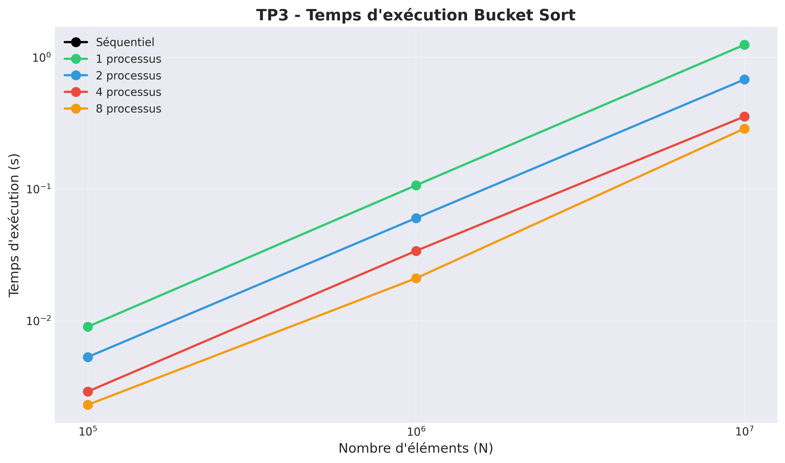
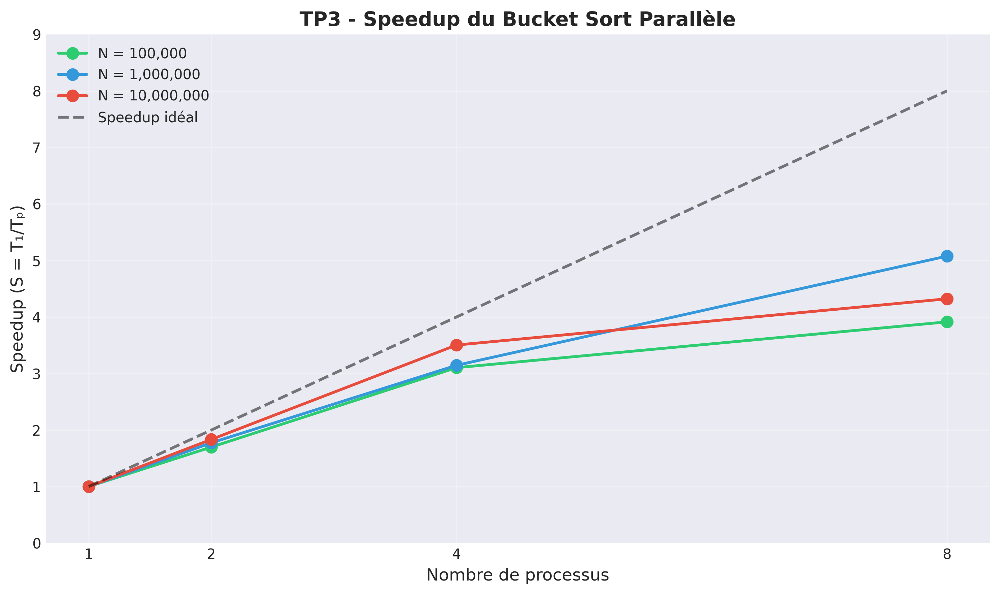
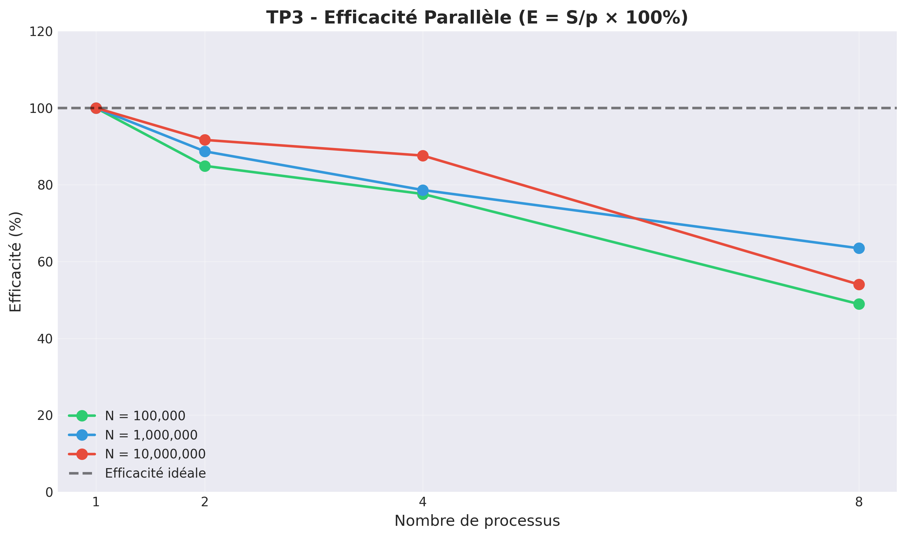
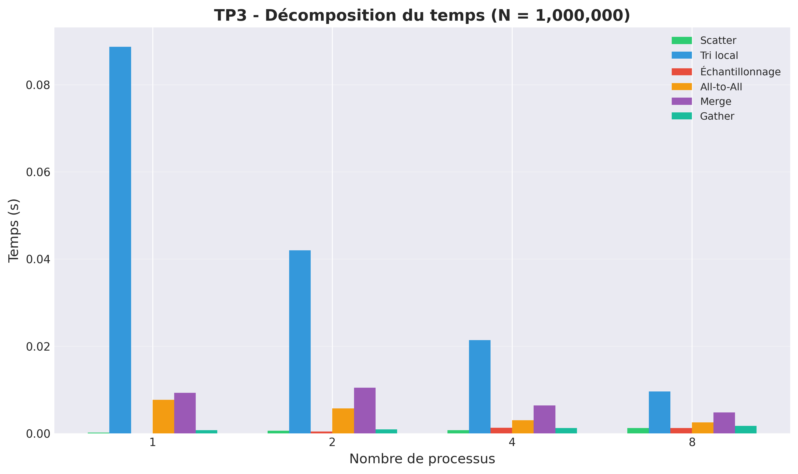
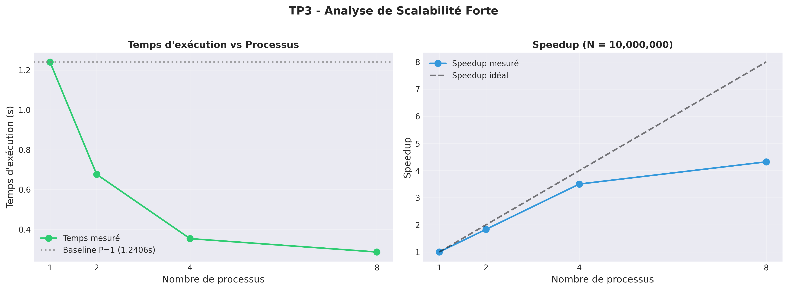

# TD3 - Bucket Sort Parallèle MPI

**Auteur :** LIANG Tianyi  
**Date :** 3 Février 2026  
**Environnement :** Ubuntu 22.04 VM (macOS host)

---

## Objectif

Implémenter l'algorithme **Bucket Sort parallèle** avec MPI, en utilisant l'approche **Sample Sort** décrite dans le cours n°3.

---

## Algorithme Sample Sort

### Principe

Le Bucket Sort classique répartit les éléments dans des intervalles fixes. En parallèle, cela pose un problème : si les données ne sont pas uniformes, certains processus reçoivent plus d'éléments que d'autres.

**Sample Sort** résout ce problème en calculant les frontières des buckets à partir d'échantillons prélevés sur toutes les données, garantissant ainsi un équilibrage adaptatif.

### Étapes

1. **Scatter** : Process 0 génère N nombres et les distribue
2. **Tri local** : chaque processus trie sa portion avec `std::sort`
3. **Échantillonnage** : chaque processus prélève p échantillons réguliers
4. **Calcul des pivots** : les p² échantillons sont triés, p-1 pivots sont sélectionnés
5. **All-to-All** : chaque élément est envoyé au processus dont l'intervalle le contient
6. **Merge k-way** : fusion de p listes triées avec un tas (heap)
7. **Gather** : rassemblement du résultat trié

### Flux de données

```
                          ┌─────────────────────────────────────────┐
                          │    P0 génère N éléments aléatoires      │
                          └───────────────┬─────────────────────────┘
                                          │ Scatterv
      ┌───────────────┬───────────────┬───┴───────────┬───────────────┐
      ▼               ▼               ▼               ▼               
   ┌─────┐         ┌─────┐         ┌─────┐         ┌─────┐           
   │ P0  │         │ P1  │         │ P2  │         │ P3  │           
   │sort │         │sort │         │sort │         │sort │           
   └──┬──┘         └──┬──┘         └──┬──┘         └──┬──┘           
      │               │               │               │               
      └───────────────┴───────────────┴───────────────┘               
                          │ Allgather échantillons                   
                          ▼                                          
                ┌─────────────────────┐                              
                │ Calcul des pivots   │                              
                │ [p0, p1, p2, ...]   │                              
                └─────────┬───────────┘                              
                          │ MPI_Alltoallv                            
      ┌───────────────┬───┴───────────┬───────────────┐              
      ▼               ▼               ▼               ▼              
   ┌─────┐         ┌─────┐         ┌─────┐         ┌─────┐          
   │merge│         │merge│         │merge│         │merge│          
   │[0,p0]│        │(p0,p1]│       │(p1,p2]│       │(p2,1]│          
   └──┬──┘         └──┬──┘         └──┬──┘         └──┬──┘          
      └───────────────┴───────────────┴───────────────┘              
                          │ Gatherv                                  
                          ▼                                          
                ┌─────────────────────┐                              
                │  Tableau trié (P0)  │                              
                └─────────────────────┘                              
```

---

## Résultats expérimentaux

### Version séquentielle (référence)

| N | Génération | Tri | Total |
|---|------------|-----|-------|
| 10⁵ | 0.0004s | 0.0048s | **0.0052s** |
| 10⁶ | 0.0035s | 0.0628s | **0.0663s** |
| 10⁷ | 0.0346s | 0.7721s | **0.8067s** |

**Complexité observée** : Le temps de tri évolue en O(N log N) comme attendu. Le ratio 10⁶/10⁵ ≈ 13× et 10⁷/10⁶ ≈ 12×, cohérent avec la théorie.

### Version parallèle MPI

#### N = 10⁶ (1 million d'éléments)

| P | Scatter | Tri local | Sample | All-to-All | Merge | Gather | **Total** |
|---|---------|-----------|--------|------------|-------|--------|-----------|
| 1 | 0.0002 | 0.0887 | 0.0000 | 0.0077 | 0.0093 | 0.0007 | **0.1066** |
| 2 | 0.0006 | 0.0420 | 0.0004 | 0.0057 | 0.0105 | 0.0009 | **0.0601** |
| 4 | 0.0007 | 0.0214 | 0.0013 | 0.0030 | 0.0064 | 0.0012 | **0.0339** |
| 8 | 0.0012 | 0.0096 | 0.0012 | 0.0025 | 0.0048 | 0.0017 | **0.0210** |

**Analyse N=10⁶** : Le tri local passe de 88.7ms (P=1) à 9.6ms (P=8), soit 9.2× de réduction. Le temps total passe de 107ms à 21ms, soit 5.1× de speedup. La différence vient de l'overhead de communication qui devient proportionnellement plus important.

#### N = 10⁷ (10 millions d'éléments)

| P | Scatter | Tri local | Sample | All-to-All | Merge | Gather | **Total** |
|---|---------|-----------|--------|------------|-------|--------|-----------|
| 1 | 0.0024 | 1.0164 | 0.0000 | 0.1070 | 0.0995 | 0.0153 | **1.2406** |
| 2 | 0.0054 | 0.4841 | 0.0033 | 0.0623 | 0.1064 | 0.0152 | **0.6767** |
| 4 | 0.0067 | 0.2346 | 0.0033 | 0.0327 | 0.0640 | 0.0128 | **0.3541** |
| 8 | 0.0095 | 0.1434 | 0.0201 | 0.0303 | 0.0586 | 0.0251 | **0.2871** |

**Analyse N=10⁷** : Avec 10× plus de données, le ratio calcul/communication s'améliore. Le tri local domine (82% du temps pour P=1), permettant une meilleure scalabilité.

### Speedup et Efficacité

*Baseline : temps avec P=1 (version parallèle, incluant l'overhead MPI)*

| N | P | Temps (s) | Speedup | Efficacité |
|---|---|-----------|---------|------------|
| 10⁵ | 2 | 0.0053 | 1.70× | 85% |
| 10⁵ | 4 | 0.0029 | 3.10× | 78% |
| 10⁵ | 8 | 0.0023 | 3.91× | 49% |
| 10⁶ | 2 | 0.0601 | 1.77× | 89% |
| 10⁶ | 4 | 0.0339 | 3.15× | 79% |
| 10⁶ | 8 | 0.0210 | 5.08× | 63% |
| 10⁷ | 2 | 0.6767 | 1.83× | 92% |
| 10⁷ | 4 | 0.3541 | 3.50× | 88% |
| 10⁷ | 8 | 0.2871 | 4.32× | 54% |

---

## Graphiques

### Temps d'exécution



Le temps décroît avec le nombre de processus, mais la pente s'atténue pour P>4.

### Speedup



Le speedup s'éloigne de l'idéal (ligne pointillée) à mesure que P augmente. N=10⁷ offre le meilleur speedup à P=4 (3.50×).

### Efficacité parallèle



L'efficacité chute de 92% (P=2) à 54% (P=8) pour N=10⁷. La loi d'Amdahl explique cette limite : la partie non-parallélisable (communications) devient prépondérante.

### Décomposition du temps (N = 10⁶)



Le tri local (barres vertes) diminue linéairement avec P. Le temps de merge reste quasi-constant car il dépend de log(P).

### Scalabilité forte (N = 10⁷)



---

## Analyse détaillée

### Répartition du temps

Pour P=8 et N=10⁷ :

| Composante | Temps | % du total |
|------------|-------|------------|
| Tri local | 0.1434 | 50% |
| Merge | 0.0586 | 20% |
| All-to-All | 0.0303 | 11% |
| Sample | 0.0201 | 7% |
| Gather | 0.0251 | 9% |
| Scatter | 0.0095 | 3% |

Le tri local reste l'étape dominante, mais les communications représentent 30% du temps total à 8 processus.

### Équilibrage de charge

Sample Sort garantit un équilibrage proche de l'optimal. Pour P=8 et N=10⁷, chaque processus reçoit environ 1.25M éléments (±2%) après redistribution.

### Comparaison avec le séquentiel

| N | Séquentiel | MPI (P=4) | Ratio |
|---|------------|-----------|-------|
| 10⁵ | 0.0052s | 0.0029s | 1.8× |
| 10⁶ | 0.0663s | 0.0339s | 2.0× |
| 10⁷ | 0.8067s | 0.3541s | 2.3× |

Le speedup par rapport au séquentiel pur est plus faible (~2×) car la version parallèle à P=1 inclut déjà un overhead de 60% (1.24s vs 0.80s pour N=10⁷). Cet overhead vient des étapes All-to-All et Merge qui n'existent pas dans la version séquentielle simple.

### Limites

1. **Overhead All-to-All** : Complexité O(p²) pour l'échange des counts
2. **Merge k-way** : O(N/p × log p) reste significatif
3. **Mémoire** : Chaque processus stocke temporairement 2× ses données

---

## Conclusion

Le Sample Sort parallèle atteint une efficacité de 79-88% à 4 processus pour N≥10⁶. L'algorithme est adapté aux grandes données où le calcul domine. Pour P>4, l'overhead de communication All-to-All limite la scalabilité, conformément à la loi d'Amdahl.

**Recommandation** : utiliser 4 processus pour un bon compromis speedup/efficacité.

---

## Annexe : Compilation

```bash
cd tp3/sources && make all
./bucket_sort_seq.exe 1000000
mpirun -np 4 ./bucket_sort_mpi.exe 1000000
python3 plot_results.py
```
