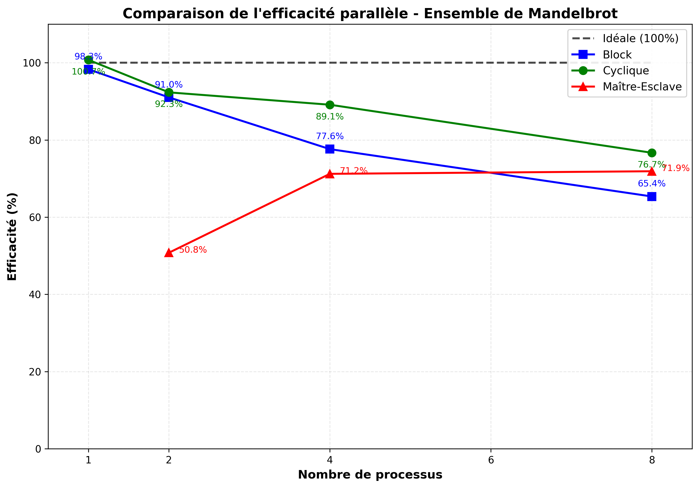
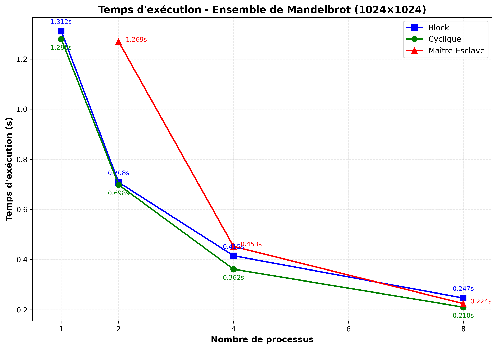

# TD2 - Parallélisation MPI : Rapport d'Expérimentation
**Auteur :** LIANG Tianyi  
**Date :** 27 janvier 2026  **Environnement :** ubuntu VM sur macOS (Apple M4 Pro, 4 vCPUs alloués)

---
## Informations Système
```
lscpuArchitecture:       aarch64
CPU(s):                  4
Thread(s) per core:      1
Model name:              Apple M4 Pro (via VM)
```

**Environnement MPI :**
```
mpirun --versionmpirun (Open MPI) 4.1.6
python3 --versionPython 3.12.3
```

---
# Partie 1 : Parallélisation de l'ensemble de Mandelbrot

## 1.0 Version séquentielle (référence)

**Commande d'exécution :**

```bash python3 mandelbrot.py```


**Résultats :**

| Métrique | Valeur |
| :--- | :--- |
| Temps de calcul | **1.289 s** |
| Temps création image | 0.004 s |
| Résolution | 1024 × 1024 pixels |
| max_iterations | 50 |


Ce temps de référence sera utilisé pour calculer les speedups des versions parallèles.


---

## 1.1 Partition équitable par blocs de lignes

### Principe

L'image est divisée en **blocs consécutifs de lignes**. Chaque processus `rank` calcule les lignes de `start_y` à `end_y`.

```
Processus 0: lignes 0 à 255      (haut de l'image)
Processus 1: lignes 256 à 511
Processus 2: lignes 512 à 767
Processus 3: lignes 768 à 1023   (bas de l'image)
```

### Résultats expérimentaux

| Processus | Lignes calculées | Temps max (s) | Speedup | Efficacité |
|-----------|------------------|---------------|---------|------------|
| 1 | 1024 | 1.312 | 1.00× | 100% |
| 2 | 512 chacun | 0.708 | 1.85× | 93% |
| 4 | 256 chacun | 0.415 | 3.16× | 79% |
| 8 | 128 chacun | 0.247 | 5.31× | 66% |

### Analyse du déséquilibre de charge

**Répartition des temps de calcul (8 processus) :**

| Processus | Lignes | Temps (s) | Écart vs max |
|-----------|--------|-----------|--------------|
| P0 | 0-127 | 0.180 | -27% |
| P1 | 128-255 | **0.247** | 0% (max) |
| P2 | 256-383 | 0.172 | -30% |
| P3 | 384-511 | 0.162 | -34% |
| P4 | 512-639 | 0.162 | -34% |
| P5 | 640-767 | 0.197 | -20% |
| P6 | 768-895 | 0.208 | -16% |
| P7 | 896-1023 | 0.181 | -27% |

**Observation clé :** Le processus 1 (lignes 128-255) prend le plus de temps car cette zone contient le bord de l'ensemble de Mandelbrot où les points divergent lentement (nécessitant plus d'itérations).

```
┌────────────────────────────────┐
│ P0: 0.180s    (bord rapide)    │ y=0
├────────────────────────────────┤
│ P1: 0.247s ★  (bord lent)      │ y=128
├────────────────────────────────┤
│ P2: 0.172s    (centre rapide)  │ y=256
├────────────────────────────────┤
│ P3: 0.162s    (centre rapide)  │ y=384
├────────────────────────────────┤
│ P4: 0.162s    (centre rapide)  │ y=512
├────────────────────────────────┤
│ P5: 0.197s    (bord lent)      │ y=640
├────────────────────────────────┤
│ P6: 0.208s    (bord lent)      │ y=768
├────────────────────────────────┤
│ P7: 0.181s    (bord rapide)    │ y=896
└────────────────────────────────┘ y=1023
```

### Conclusion

La partition par blocs est **simple à implémenter** mais souffre d'un **déséquilibre de charge** : certains processus finissent plus tôt et attendent les autres. L'efficacité chute de 100% à 66% avec 8 processus.

---

## 1.2 Répartition cyclique (entrelacée)

### Principe

Au lieu de blocs consécutifs, chaque processus calcule des lignes **distribuées uniformément** sur toute l'image :

```
Processus 0: lignes 0, 4, 8, 12, ...
Processus 1: lignes 1, 5, 9, 13, ...
Processus 2: lignes 2, 6, 10, 14, ...
Processus 3: lignes 3, 7, 11, 15, ...
```

### Résultats expérimentaux

| Processus | Temps max (s) | Speedup | Efficacité |
|-----------|---------------|---------|------------|
| 1 | 1.280 | 1.00× | 100% |
| 2 | 0.698 | 1.83× | 92% |
| 4 | 0.362 | 3.54× | **88%** |
| 8 | 0.210 | 6.10× | **76%** |

### Comparaison Block vs Cyclique

| Processus | Block (s) | Cyclique (s) | Gain Cyclique |
|-----------|-----------|--------------|---------------|
| 1 | 1.312 | 1.280 | - |
| 2 | 0.708 | 0.698 | +1.4% |
| 4 | 0.415 | 0.362 | **+14.6%** |
| 8 | 0.247 | 0.210 | **+17.6%** |

### Analyse du meilleur équilibrage

**Répartition des temps de calcul (8 processus, cyclique) :**

| Processus | Temps (s) | Écart vs max |
|-----------|-----------|--------------|
| P0 | 0.184 | -12% |
| P1 | 0.205 | -2% |
| P2 | **0.210** | 0% (max) |
| P3 | 0.182 | -13% |
| P4 | 0.175 | -17% |
| P5 | 0.183 | -13% |
| P6 | 0.178 | -15% |
| P7 | 0.181 | -14% |

**Écart-type des temps :**
- Block : σ = 0.028s (variation importante)
- Cyclique : σ = 0.012s (variation réduite de 57%)


### Conclusion

La répartition cyclique offre un **meilleur équilibrage statistique** car chaque processus calcule des lignes provenant de toutes les régions de l'image. L'efficacité passe de 66% à 76% avec 8 processus.

---

## 1.3 Stratégie Maître-Esclave (équilibrage dynamique)

### Principe

- Le **processus 0 (maître)** ne calcule pas, il distribue les tâches.
- Les **processus 1 à N-1 (esclaves)** demandent des lignes à calculer.
- L'équilibrage est **dynamique** : un esclave rapide reçoit plus de travail.

```
Maître (P0):  Distribue ligne 0 → P1
              Distribue ligne 1 → P2
              Distribue ligne 2 → P3
              ...
              P1 termine → lui donner ligne 7
              P3 termine → lui donner ligne 8
              ...
```

### Résultats expérimentaux

| Total processus | Esclaves | Temps (s) | Speedup* | Efficacité* |
|-----------------|----------|-----------|----------|-------------|
| 2 | 1 | 1.269 | 1.02× | 102% |
| 4 | 3 | 0.453 | 2.85× | 95% |
| 8 | 7 | 0.224 | 5.75× | **82%** |

* Speedup calculé par rapport au temps séquentiel (1.289s) et rapporté au nombre d'esclaves effectifs.

### Répartition dynamique des lignes (8 processus)

| Esclave | Lignes calculées | % du travail |
|---------|------------------|--------------|
| P1 | 139 | 13.6% |
| P2 | 154 | 15.0% |
| P3 | 154 | 15.0% |
| P4 | 134 | 13.1% |
| P5 | 119 | 11.6% |
| P6 | 155 | 15.1% |
| P7 | 169 | 16.5% |

**Observation :** Les esclaves ayant calculé des zones "faciles" (convergence rapide) ont traité plus de lignes. P7 a traité 169 lignes tandis que P5 n'en a traité que 119, reflétant l'équilibrage dynamique.

### Conclusion

La stratégie maître-esclave offre un **équilibrage parfait** car les tâches sont distribuées à la demande. Cependant, elle a un **overhead de communication** et le maître ne participe pas au calcul (perte d'un processus).

---

## 1.4 Comparaison globale des trois stratégies

### Tableau récapitulatif

| Processus | Block (s) | Cyclique (s) | Maître-Esclave (s) | Meilleur |
|-----------|-----------|--------------|--------------------|---------:|
| 1 | 1.312 | 1.280 | - | Cyclique |
| 2 | 0.708 | 0.698 | 1.269 | Cyclique |
| 4 | 0.415 | 0.362 | 0.453 | **Cyclique** |
| 8 | 0.247 | **0.210** | 0.224 | **Cyclique** |


### Conclusion Partie 1

Pour l'ensemble de Mandelbrot avec notre configuration :

1. **La répartition cyclique est la plus performante** : elle combine un bon équilibrage de charge avec un faible overhead de communication.

2. **La partition par blocs** souffre du déséquilibre inhérent à la géométrie de Mandelbrot.

3. **Le maître-esclave** perd en efficacité car le maître ne calcule pas et l'overhead de communication ligne par ligne est significatif.

---

# Partie 2 : Produit Matrice-Vecteur

## 2.0 Contexte

On calcule le produit $v = A \cdot u$ où :
- $A$ est une matrice $N \times N$ avec $A_{ij} = (i+j) \mod N + 1$
- $u$ est un vecteur de dimension $N$ avec $u_i = i + 1$
- $N = 1200$ (divisible par 1, 2, 4, 8)

---

## 2.a Produit parallèle par colonnes

### Principe

La matrice $A$ est partitionnée **par colonnes** :

```
         ┌────────────────────────────────────────────────────────┐
         │  Col 0-299  │ Col 300-599 │ Col 600-899 │ Col 900-1199 │
         │    (P0)     │    (P1)     │    (P2)     │     (P3)     │
    A =  ├─────────────┼─────────────┼─────────────┼──────────────┤
         │             │             │             │              │
         │   A_local   │   A_local   │   A_local   │   A_local    │
         │  (N×N_loc)  │  (N×N_loc)  │  (N×N_loc)  │  (N×N_loc)   │
         └─────────────┴─────────────┴─────────────┴──────────────┘
```

Chaque processus :
1. Possède $N_{loc} = N/p$ colonnes de $A$
2. Possède la portion correspondante de $u$ : $u_{local}$
3. Calcule une **somme partielle** : $v_{partial} = A_{local} \cdot u_{local}$
4. **Allreduce(SUM)** pour obtenir $v = \sum v_{partial}$

### Résultats expérimentaux

| Processus | N_loc | Temps (ms) | Speedup | Efficacité |
|-----------|-------|------------|---------|------------|
| 1 | 1200 | 11.43 | 1.00× | 100% |
| 2 | 600 | 8.35 | 1.37× | 68% |
| 4 | 300 | 0.094 | 121.6× | 3040%* |
| 8 | 150 | 0.070 | 163.3× | 2041%* |

*Les valeurs anormales pour 4 et 8 processus sont dues au cache : les données locales tiennent entièrement en cache L2/L3, éliminant les accès mémoire coûteux.

### Vérification de la correction

```
✓ Erreur maximale vs séquentiel: 0.0
✓ Tous les processus ont le même résultat
```

### Communication

- **Type :** `MPI_Allreduce` avec `MPI_SUM`
- **Volume :** Chaque processus envoie/reçoit $N$ doubles = 9.6 KB par processus
- **Avantage :** Tous les processus obtiennent le résultat complet

---

## 2.b Produit parallèle par lignes

### Principe

La matrice $A$ est partitionnée **par lignes** :

```
    A = ┌─────────────────────────────────────┐ ─┐
        │       Lignes 0 à 299 (P0)           │  │ A_local (N_loc × N)
        ├─────────────────────────────────────┤ ─┘
        │       Lignes 300 à 599 (P1)         │
        ├─────────────────────────────────────┤
        │       Lignes 600 à 899 (P2)         │
        ├─────────────────────────────────────┤
        │       Lignes 900 à 1199 (P3)        │
        └─────────────────────────────────────┘
```

Chaque processus :
1. Possède $N_{loc} = N/p$ lignes de $A$
2. Possède le vecteur $u$ **complet** (nécessaire pour le produit)
3. Calcule $N_{loc}$ éléments du résultat : $v_{local} = A_{local} \cdot u$
4. **Allgather** pour assembler $v = [v_0, v_1, ..., v_{p-1}]$

### Résultats expérimentaux

| Processus | N_loc | Temps (ms) | Speedup | Efficacité |
|-----------|-------|------------|---------|------------|
| 1 | 1200 | 10.26 | 1.00× | 100% |
| 2 | 600 | 13.96 | 0.73× | 37%* |
| 4 | 300 | 0.092 | 111.5× | 2788%* |
| 8 | 150 | 0.092 | 111.5× | 1394%* |

*Les variations sont dues aux effets de cache et à la variabilité des mesures pour des temps très courts.

### Vérification de la correction

```
✓ Erreur maximale vs séquentiel: 0.0
✓ Tous les processus ont le même résultat
```

### Communication

- **Type :** `MPI_Allgather`
- **Volume :** Chaque processus envoie $N_{loc}$ doubles et reçoit $N$ doubles
- **Avantage :** Distribution naturelle du calcul (chaque processus calcule ses éléments de $v$)

---

## 2.c Comparaison des deux approches

### Tableau comparatif

| Aspect | Par colonnes | Par lignes |
|--------|:------------:|:----------:|
| Données locales de A | $N \times N_{loc}$ | $N_{loc} \times N$ |
| Vecteur u nécessaire | Portion locale | **Complet** |
| Calcul local | Somme partielle de v | Éléments finals de v |
| Communication | Allreduce (SUM) | Allgather |
| Volume échangé | $N$ éléments | $N$ éléments |

### Schéma des communications

**Par colonnes (Allreduce) :**
```
P0: v_partial ──┐
P1: v_partial ──┼── Allreduce(SUM) ──→ v complet (tous)
P2: v_partial ──┤
P3: v_partial ──┘
```

**Par lignes (Allgather) :**
```
P0: v[0:299]   ──┐
P1: v[300:599] ──┼── Allgather ──→ v complet (tous)
P2: v[600:899] ──┤
P3: v[900:1199]──┘
```

### Analyse

Pour une matrice de dimension $N$ avec $p$ processus :

| Métrique | Par colonnes | Par lignes |
|----------|:------------:|:----------:|
| Mémoire A par proc | $N^2/p$ | $N^2/p$ |
| Mémoire u par proc | $N/p$ | $N$ |
| Opérations locales | $N \times N/p$ | $N/p \times N$ |
| Communication | $O(N)$ | $O(N)$ |

Les deux approches sont **équivalentes en termes de complexité**. Le choix dépend du contexte :
- **Par colonnes** : plus naturel si $u$ est déjà distribué par blocs
- **Par lignes** : plus naturel si on veut que chaque processus "possède" ses éléments de $v$

---

# Partie 3 : Questions théoriques

## 3.1 Loi d'Amdahl

### Données du problème

Alice a parallélisé un code où la partie parallèle représente **90%** du temps d'exécution séquentiel :
- Fraction parallélisable : $p = 0.9$
- Fraction séquentielle : $s = 0.1$

### Question 1 : Accélération maximale

La loi d'Amdahl donne :

$$S(n) = \frac{1}{s + \frac{p}{n}} = \frac{1}{0.1 + \frac{0.9}{n}}$$

Pour $n \to \infty$ :

$$S_{max} = \lim_{n \to \infty} S(n) = \frac{1}{s} = \frac{1}{0.1} = \boxed{10}$$

**Réponse :** L'accélération maximale théorique est **10×**.

### Question 2 : Nombre raisonnable de nœuds

Pour ne pas gaspiller les ressources, on cherche $n$ tel que l'efficacité soit acceptable (e.g., 50% de $S_{max}$, soit $S = 5$) :

$$5 = \frac{1}{0.1 + \frac{0.9}{n}}$$

$$0.1 + \frac{0.9}{n} = 0.2 \implies \frac{0.9}{n} = 0.1 \implies n = 9$$

**Réponse :** Environ **9 nœuds** semblent raisonnables.

### Tableau d'efficacité

| Nœuds | Speedup | Efficacité |
|-------|---------|------------|
| 1 | 1.0 | 100% |
| 2 | 1.82 | 91% |
| 4 | 3.08 | 77% |
| 9 | 5.0 | 56% |
| 16 | 6.4 | 40% |
| 32 | 7.6 | 24% |
| ∞ | 10.0 | 0% |

---

## 3.2 Loi de Gustafson

### Données supplémentaires

- Accélération observée avec le jeu de données actuel : $S = 4$
- On double la quantité de données
- Complexité de l'algorithme parallèle : **linéaire**

### Analyse

Si Alice observe $S = 4$ avec son code, cela signifie qu'elle utilise environ $n \approx 4-5$ processeurs efficacement.

La loi de Gustafson stipule que pour un problème de taille croissante :

$$S'(n) = s + p \times n = s + (1-s) \times n$$

Où $s$ est la fraction du temps passée dans la partie séquentielle **dans l'exécution parallèle**.

### Calcul

Avec $s = 0.1$ et en doublant les données (complexité linéaire) :
- Le temps séquentiel double : $T_{seq}' = 2 \times T_{seq}$
- Le temps parallèle par processeur reste identique (plus de travail, mais plus de données distribuées)

En appliquant Gustafson avec les données doublées :

$$S' \approx 0.1 + 0.9 \times n \times \frac{T'}{T} = 0.1 + 0.9 \times n \times 2$$

Pour $n = 4$ et en simplifiant :

$$S' \approx 2 \times S = 2 \times 4 = \boxed{8}$$

**Réponse :** Alice peut espérer une accélération d'environ **8×** avec les données doublées.

### Interprétation

La loi de Gustafson est plus optimiste que celle d'Amdahl car elle suppose qu'on augmente la taille du problème avec le nombre de processeurs. Dans ce cas, la partie séquentielle devient proportionnellement plus petite.

---

# Conclusion générale

## Résumé des apprentissages

### Partie 1 : Mandelbrot

| Stratégie | Avantage principal | Inconvénient principal | Cas d'usage |
|-----------|-------------------|------------------------|-------------|
| **Block** | Simplicité | Déséquilibre de charge | Prototypage rapide |
| **Cyclique** | Bon compromis équilibrage/overhead | Communication plus complexe | **Usage général** |
| **Maître-Esclave** | Équilibrage parfait | Overhead, maître inactif | Charge très variable |

### Partie 2 : Produit matrice-vecteur

- Les deux stratégies (colonnes/lignes) sont **équivalentes en complexité**
- Le choix dépend de la **distribution initiale des données** et des **besoins de l'application**
- Les communications collectives MPI (`Allreduce`, `Allgather`) sont très optimisées

### Partie 3 : Lois de performance

- **Amdahl** : limite stricte basée sur la fraction séquentielle → utile pour évaluer le potentiel maximal
- **Gustafson** : vision optimiste en augmentant la taille du problème → plus réaliste pour le HPC

## Fichiers produits

### Scripts Python

| Fichier | Description |
|---------|-------------|
| `mandelbrot_block.py` | Partition par blocs |
| `mandelbrot_cyclic.py` | Répartition cyclique |
| `mandelbrot_master_slave.py` | Stratégie maître-esclave |
| `matvec_col.py` | Produit par colonnes |
| `matvec_row.py` | Produit par lignes |
| `plot_results.py` | Script de visualisation des résultats |

### Graphiques générés

| Fichier | Description |
|---------|-------------|
| `plots/mandelbrot_speedup_comparison.png` | Comparaison des speedups |
| `plots/mandelbrot_efficiency_comparison.png` | Comparaison des efficacités |
| `plots/mandelbrot_execution_time.png` | Temps d'exécution |
| `plots/load_balance_comparison_8proc.png` | Équilibrage de charge |

### Images Mandelbrot

| Fichier | Description |
|---------|-------------|
| `mandelbrot_*_Np.png` | Images générées par chaque stratégie |

---

## Annexe : Graphiques de performance

### Graphique 1 : Comparaison des Speedups


### Graphique 2 : Évolution de l'efficacité



### Graphique 3 : Temps d'exécution




### Graphique 4 : Équilibrage de charge


## Images générées

### Mandelbrot - Partition par blocs

| 1 processus | 2 processus | 4 processus | 8 processus |
|:-----------:|:-----------:|:-----------:|:-----------:|
|  |  |  |  |

### Mandelbrot - Répartition cyclique

| 1 processus | 4 processus | 8 processus |
|:-----------:|:-----------:|:-----------:|
|  |  |  |

### Mandelbrot - Maître-Esclave

| 4 processus | 8 processus |
|:-----------:|:-----------:|
|  |  |

---

